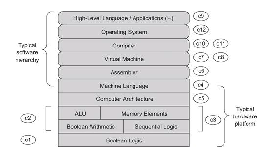
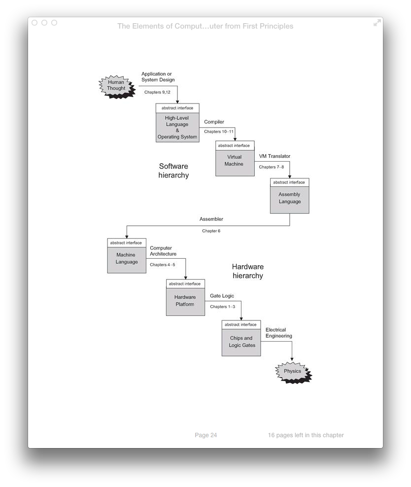
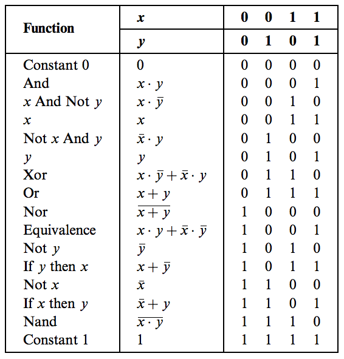
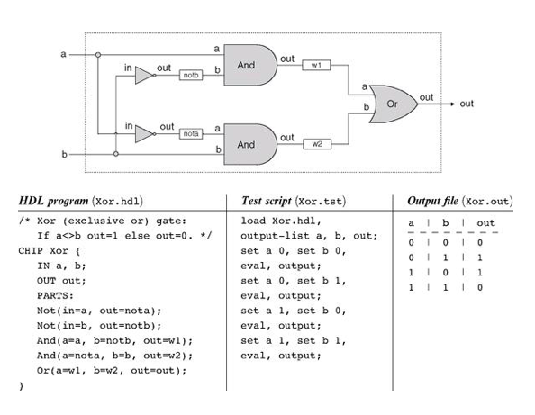
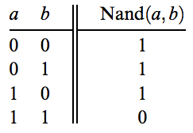
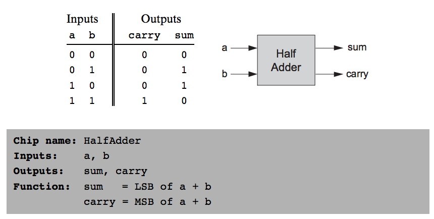
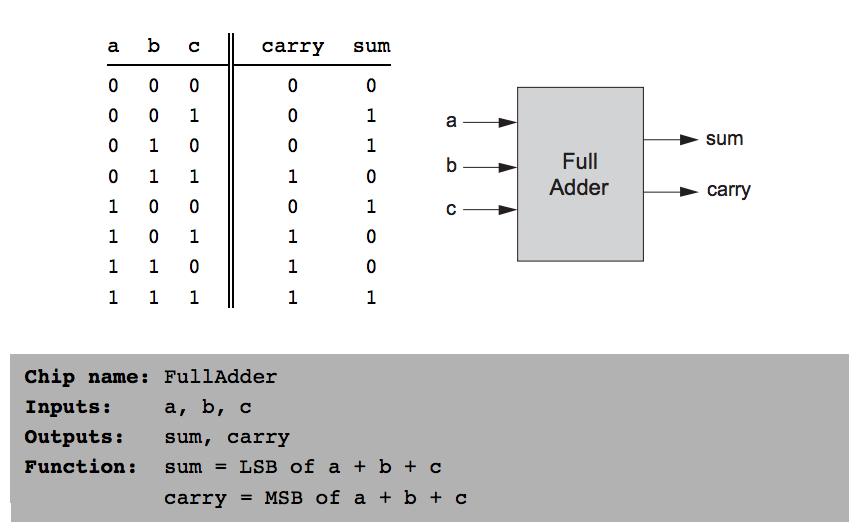
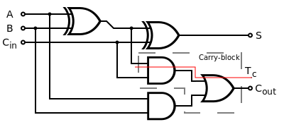
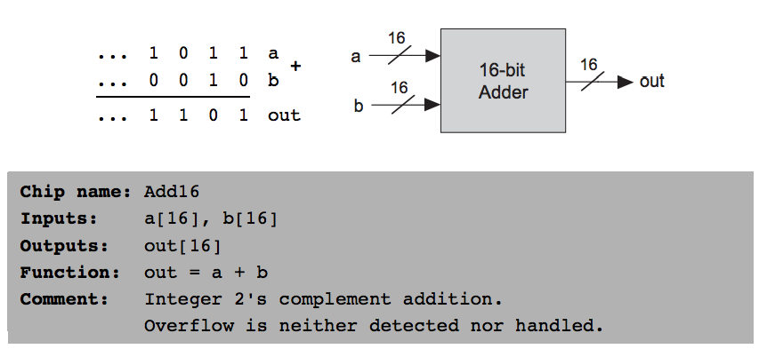
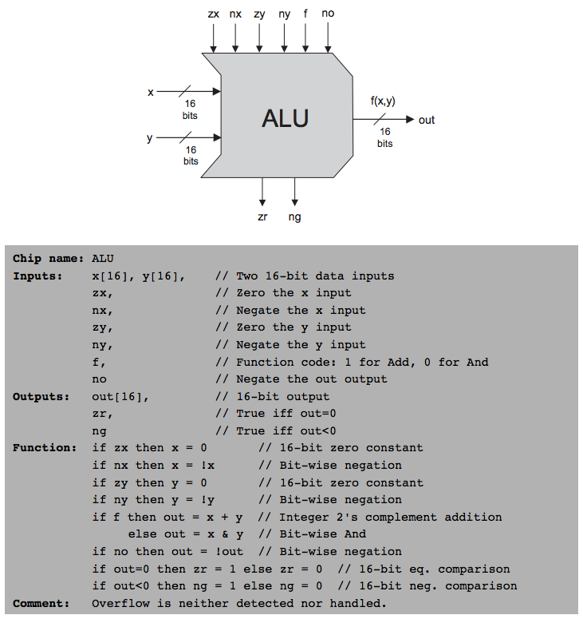

# nand2tetris

Notes and code from the book [_Elements of Computing Systems_](http://www.nand2tetris.org/).



Construct a complete computer system: hardware + software.

## Hardware: Hack
* 16-bit computer written in HDL

## Software: Jack
* Assembler
* Virtual Machine
* High-Level Language
  - Compiler
  - OS

The software components can be written in any modern programming language.

It is possible to build all of these components independently via the process of abstraction: ignoring the details of __how__ a component functions, and utilizing the component for what it __does__.



## Getting Set Up (OSX)

Extract nand2tetris.zip.

## Hardware Simulator

### Add to path
```
ln -s ~/code/nand2tetris/tools/HardwareSimulator.sh /usr/local/bin/HardwareSimulator
chmod +x /usr/local/bin/HardwareSimulator
```

### Run a test
From the `nand2tetris` folder.
```
HardwareSimulator projects/01/Nand.tst
```

## Jack Language Example

```
class Main {
  function void main() {
    do Output.printString("Hello World");
    do Output.println();
    return;
  }
}
```

Compiliation is the process of parsing text and converting it into a low-level language that a computer understands (machine code). This process is broken up into several layers of abstraction and typically involves three translators: a compiler, a vm, and an assembler.

## Compiler
The compiler's task is broken into two stages:
* syntax analysis via constructing a parse tree
* code generation via processing the parse tree

## Virtual Machine
* runs intermediate language code
* stack-based machine

## Assembler
Translates assembly code into binary code.

## Boolean Logic



Every digital device is built from the same building blocks: elementary logic gates (which consist of transistors). We can use the __Nand gate__ to construct every other logic gate.

### Implementation of a gate in HDL



Fully testing individual chips is important. Fully testing more complex systems with 100% certainty is not feasible.


### Nand gate



### Implementation of Gates (Project 01)

* [x] And
* [x] Or
* [x] Xor
* [x] Mux
* [x] DMux
* [x] Not16
* [x] And16
* [x] Or16
* [x] Mux16
* [x] Mux4Way16
* [x] Mux8Way16
* [x] DMux4Way
* [x] DMux8Way

## Boolean Arithmetic

### Binary Numbers

```
10011₂ = 1 · 2⁴ + 0 · 2³ + 0 · 2² + 1 · 2¹ + 1 · 2⁰ = 19₁₀
```

### Binary Addition

#### No Overflow
```
  1001
+ 0101
------
 01110
```

#### Overflow
```
  1011
+ 0111
------
 10010
```

### 2's Compliment
```
~x = 2ⁿ - x, if x ≠ 0
```

 Positive | Positive | Negative | Negative
:--------:|:--------:|:--------:|:-------:
 Base 10  | Base 2   | Base 2   | Base 10
 0        | 0000     |          |
 1        | 0001     | 1111     | -1
 2        | 0010     | 1110     | -2
 3        | 0011     | 1101     | -3
 4        | 0100     | 1100     | -4
 5        | 0101     | 1011     | -5
 6        | 0110     | 1010     | -6
 7        | 0111     | 1001     | -7
          |          | 1000     | -8

* To get the negative of a number, flip the bits and add one
* 2ⁿ signed numbers
* Positive numbers start with zero
* Negative numbers start with one


### HalfAdder


* sum - use `xor` gate
* carry - use `and` gate

### FullAdder



* implement with two HalfAdders or elementary gates

### Add16


### ALU



### Implementation of Gates (Project 02)

* [x] HalfAdder
* [x] FullAdder
* [x] Add16
* [x] Inc16
* [ ] ALU-nostat
* [ ] ALU


## Quotes

"Mistakes are the portals of discovery." - James Joyce

"The only kind of learning which significantly influences behavior is self-discovered or self-appropriated--truth that has been assimilated in experience." - Carl Rogers
