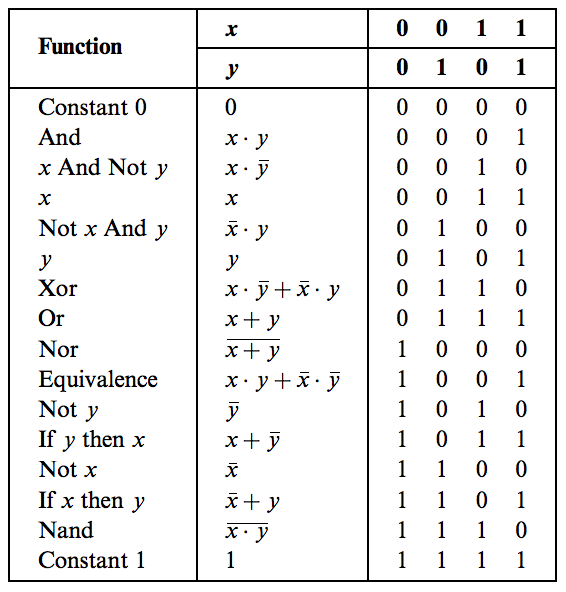

## Boolean Logic

Every digital device is built from the same building blocks: elementary logic gates (which consist of transistors). We can use the __Nand gate__ to construct every other logic gate.

### Implementation of a gate in HDL

Fully testing individual chips is important. Fully testing more complex systems with 100% certainty is not feasible.

### Nand gate

### Implementation of Gates (Project 01)

* [x] And
* [x] Or
* [x] Xor
* [x] Mux
* [x] DMux
* [x] Not16
* [x] And16
* [x] Or16
* [x] Mux16
* [x] Mux4Way16
* [x] Mux8Way16
* [x] Or8Way
* [x] DMux4Way
* [x] DMux8Way
