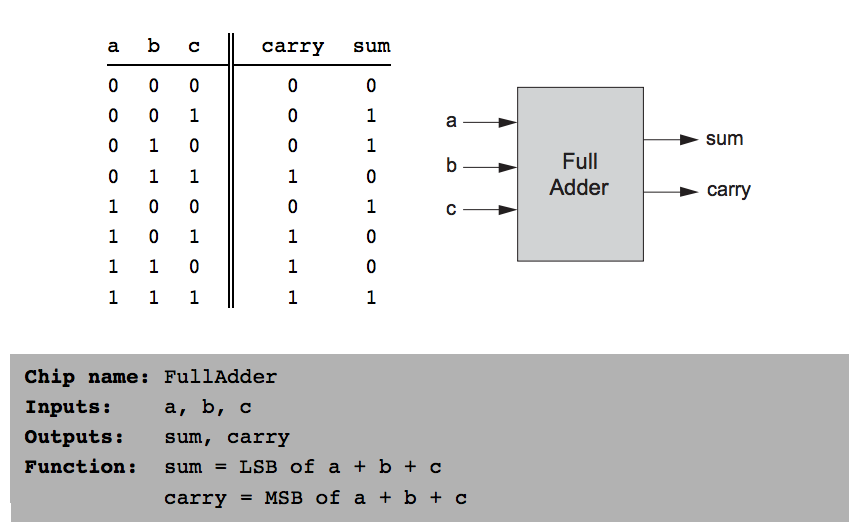

## Boolean Arithmetic

### Binary Numbers

```
10011₂ = 1 · 2⁴ + 0 · 2³ + 0 · 2² + 1 · 2¹ + 1 · 2⁰ = 19₁₀
```

### Binary Addition

#### No Overflow
```
  1001
+ 0101
------
 01110
```

#### Overflow
```
  1011
+ 0111
------
 10010
```

### 2's Compliment
```
~x = 2ⁿ - x, if x ≠ 0
```

 Positive | Positive | Negative | Negative
:--------:|:--------:|:--------:|:-------:
 Base 10  | Base 2   | Base 2   | Base 10
 0        | 0000     |          |
 1        | 0001     | 1111     | -1
 2        | 0010     | 1110     | -2
 3        | 0011     | 1101     | -3
 4        | 0100     | 1100     | -4
 5        | 0101     | 1011     | -5
 6        | 0110     | 1010     | -6
 7        | 0111     | 1001     | -7
          |          | 1000     | -8

* To get the negative of a number, flip the bits and add one
* 2ⁿ signed numbers
* Positive numbers start with zero
* Negative numbers start with one


### HalfAdder


* sum - use `xor` gate
* carry - use `and` gate

### FullAdder



* implement with two HalfAdders or elementary gates

### Add16


### ALU


* First step: create a logic circuit that manipulates a 16-bit input according to the nx and zx control bits
* nx - negate input
* zx - zero input

### Implementation of Gates (Project 02)

* [x] HalfAdder
* [x] FullAdder
* [x] Add16
* [x] Inc16
* [x] ALU-nostat
* [x] ALU
