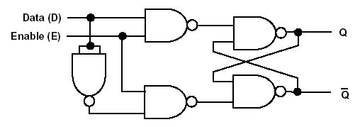
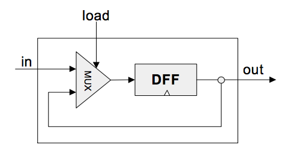
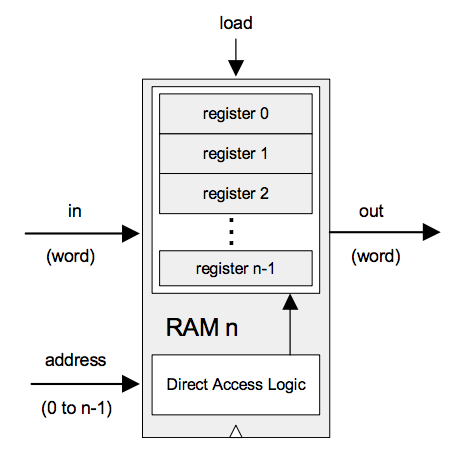

## Sequential Logic

__Combinational devices__ provide calculation services.

__Sequential devices__...
* operate on data and a clock signal
* provide storage and syncronization services
* can be based on one device: "data flip flop" or __DFF__

### SR Flip-Flop

### DFF

Memory devices are made from numerous flip-flops, all regulated by the same master clock.

### Clock

* tick - low phase
* tock - high phase
* implemented by an oscillator in production hardware

### RAM

### Implementation of Sequential Logic (Project 03)

The DFF is considered a primitive device and does not need to be implemented.

* [x] Bit
* [x] Register
* [x] RAM8
* [x] RAM64
* [x] RAM512
* [x] RAM4K
* [x] RAM16K
* [x] PC
